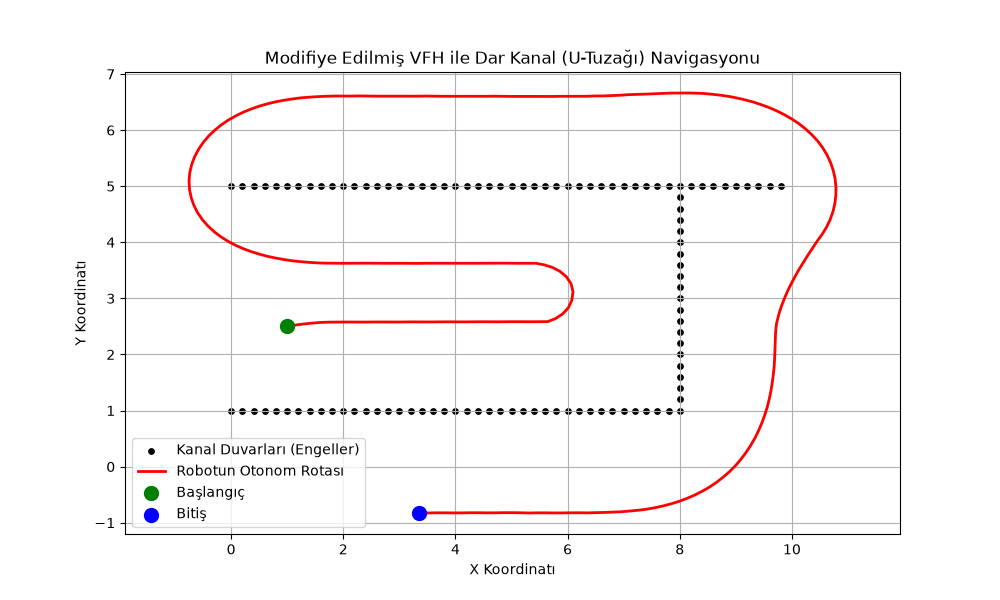
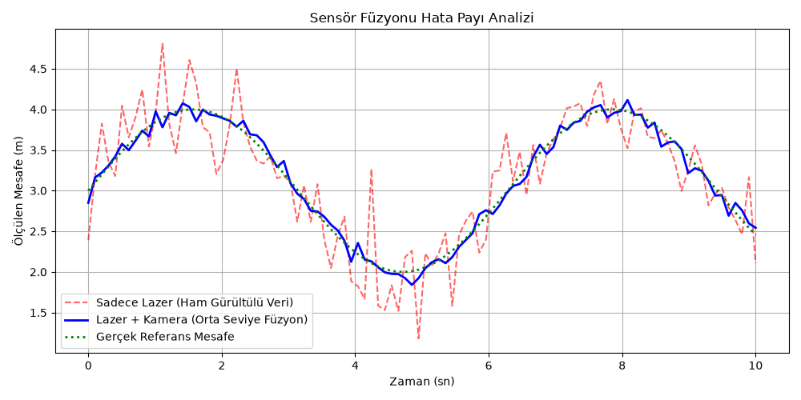
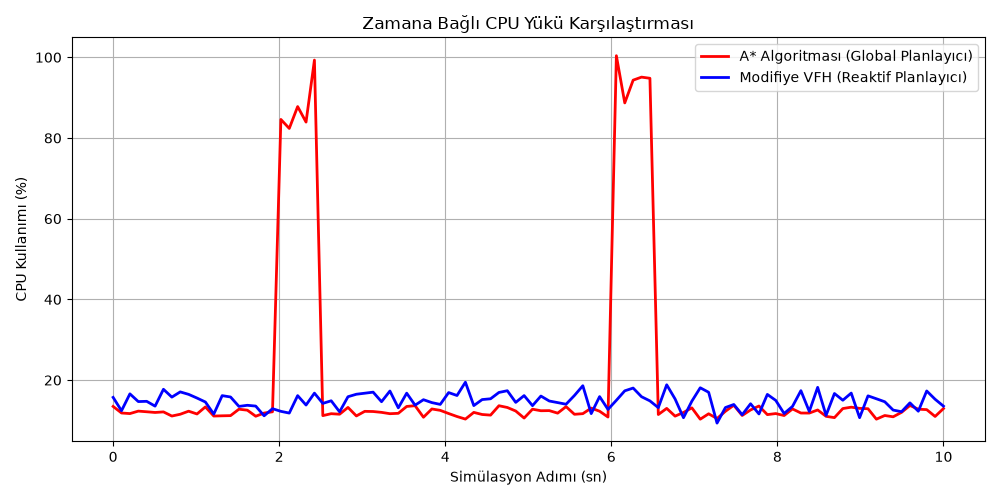

# Dar Kanal Navigasyonu İçin Sensör Füzyonu ve Modifiye VFH Simülasyonu

Bu proje, MKT5082 Mobil Robotlar ve Uygulamaları dersi kapsamında, haritası çıkarılamayan dar kanallarda görev yapan mobil robotlar için geliştirilmiş lokal bir navigasyon metodolojisidir.

## Proje Özeti
Klasik algoritmaların aksine, küresel bir hedef koordinatı kullanılmamıştır. Kamera ve lazer sensörlerinden (Lazer Nirengi) elde edildiği varsayılan çevresel veriler 2D Doluluk Izgarasında (Occupancy Grid) birleştirilmiş ve Vektör Alan Histogramı (VFH) algoritması **duvar takibi (wall-following)** yapacak şekilde modifiye edilmiştir.

## Simülasyon Sonucu (U-Tuzağı Aşımı)
Aşağıdaki grafikte, robotun yerel minimum (local minima) tuzağı olan U şeklindeki çıkmaz sokaktan, sadece duvarların itici gücünü ve normal vektörünü hesaplayarak otonom bir şekilde kurtuluşu görülmektedir:



## Ek Analizler (Performans ve Hata Toleransı)
Geliştirilen sistemin hata toleransını ve klasik algoritmalarla işlemci yükü kıyaslamasını gösteren analizler aşağıda sunulmuştur. Bu grafikleri üreten simülasyon kodlarına `ek_grafikler.py` dosyasından ulaşabilirsiniz.

### 1. Sensör Füzyonu Doğruluk (Accuracy) Analizi


### 2. CPU İşlemci Yükü (A* vs Modifiye VFH)


## Kurulum ve Çalıştırma
Simülasyon saf Python ile yazılmıştır. Çalıştırmak için sisteminizde `numpy` ve `matplotlib` kütüphanelerinin yüklü olması yeterlidir:
```bash
pip install numpy matplotlib
python main.py
Fusion_And_CPU_Analysis.py
